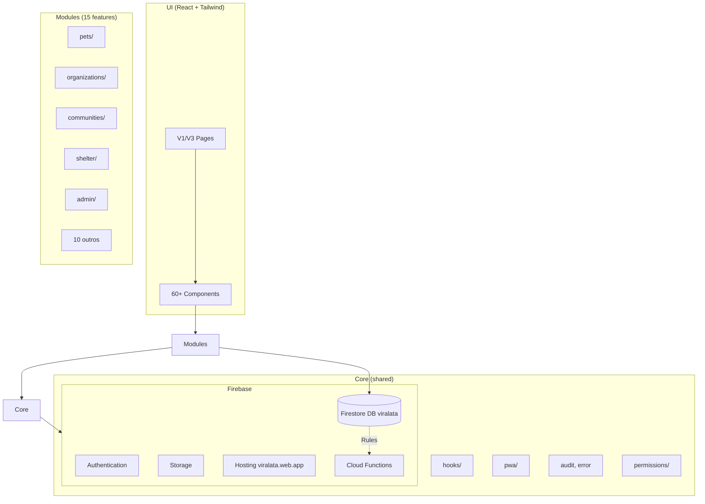
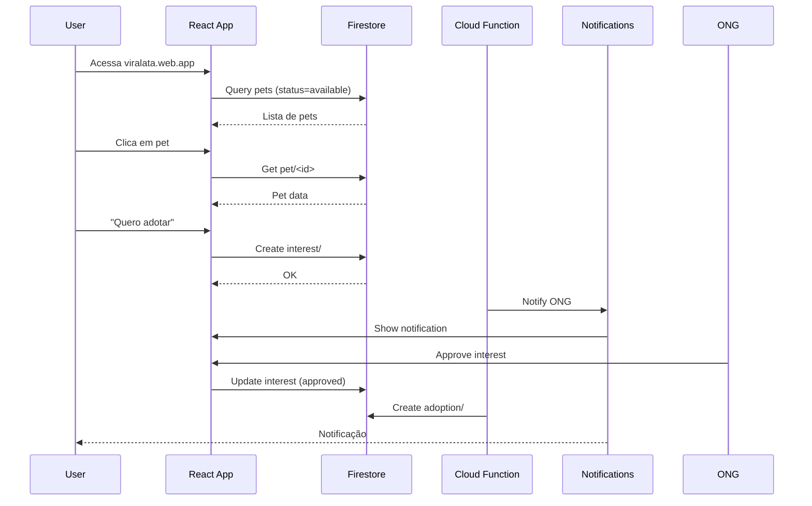
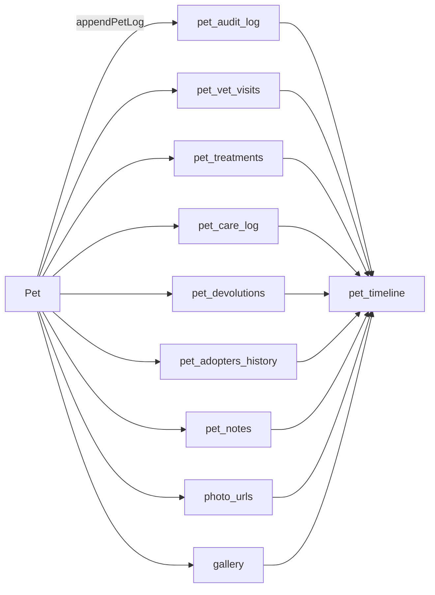
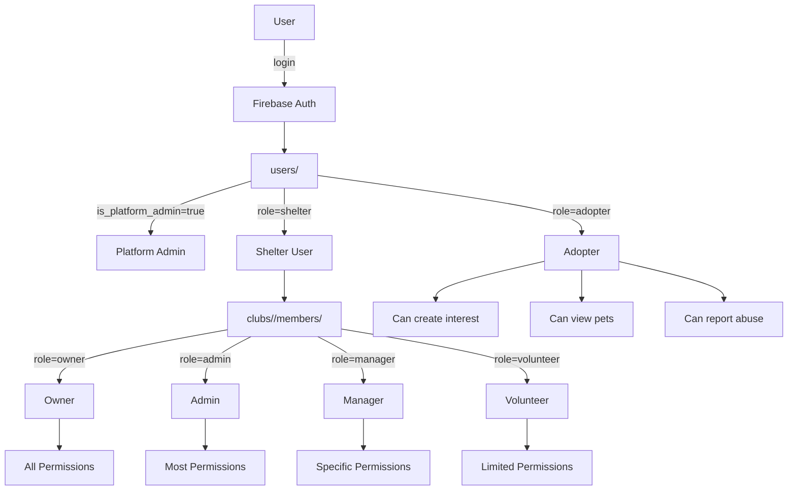
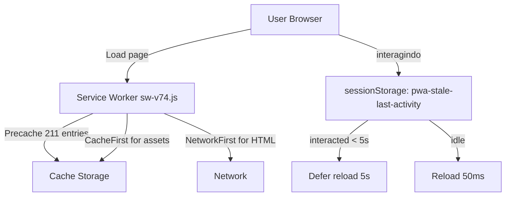
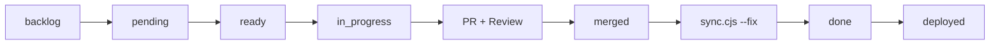
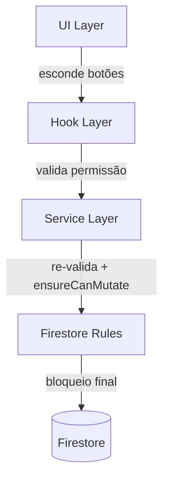
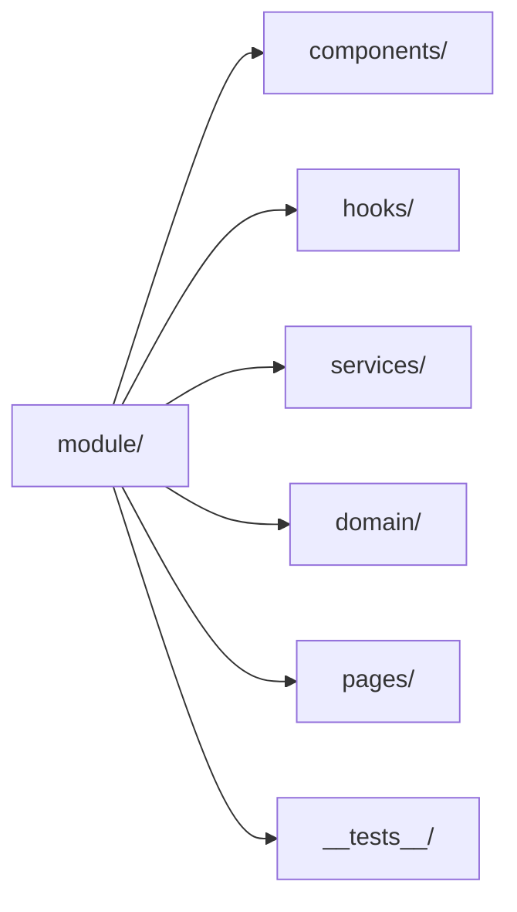
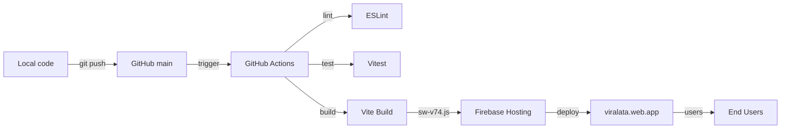
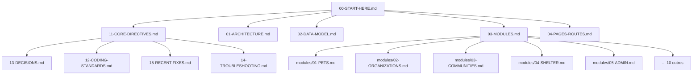

# Diagrama de Arquitetura

> Diagrama textual (Mermaid) da arquitetura do Viralata.

## §1. Camadas da Aplicação

## §2. Fluxo de Adoção

## §3. Sistema de Pet Ops V3

## §4. Sistema de Permissões

## §5. PWA / Service Worker

## §6. SCRUM Workflow

## §7. Camadas de Defesa (Defense-in-Depth)

## §8. Module Architecture

## §9. Deployment Pipeline

## §10. Documentation Map

